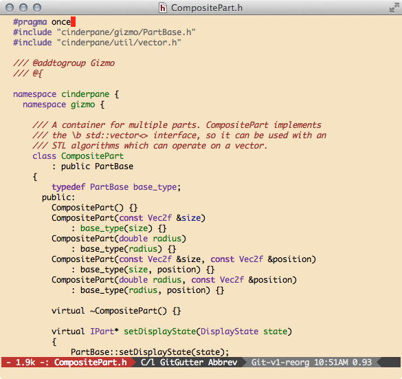

This is an emacs color theme that I've been toting around in my
`.emacs` for nearly two decades now, dating back to before Emacs even
had a color theme package. I eventually updated it to work with
`color-theme`, then `deftheme`, and finally split it out on its own to be a sharable
package.

### Screenshot



### Installation

To use it, add this file to a directory in your load-path, then put the following in your Emacs configuration file:

```emacs-lisp
(load-theme 'autumn-light t)
```
